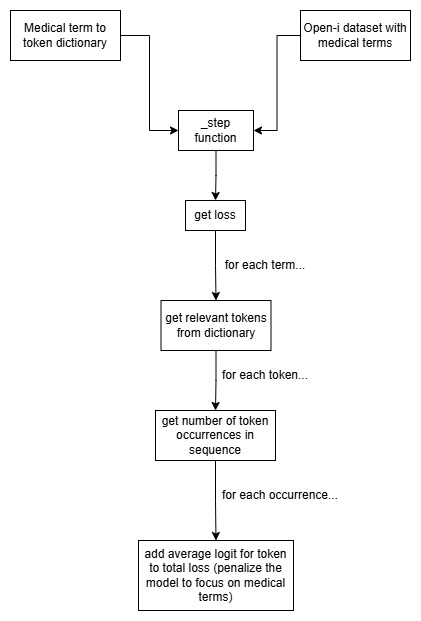

# medical-loss-FT
This is a prototype repository that hopes to implement medical loss fine tuning for Causal models meant to be used for llama3.1-8B. A simple diagram explaining the implementation can be seen below;

It must be noted that this also applies to negation terms. 

Enclosed are the dataset curated with seperated medical and negation terms (Open-i), along with the list of extracted medical terms used for the medical term dictionary and final the training code
